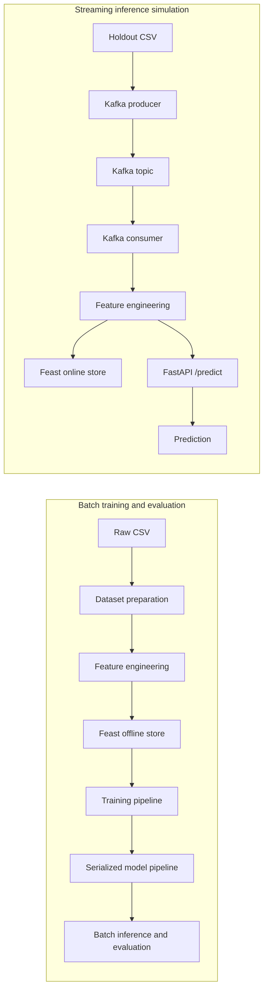

# Financial Crime Detection

<a target="_blank" href="https://cookiecutter-data-science.drivendata.org/">
    
</a>

This repository demonstrates an end-to-end machine learning prototype for transaction
laundering detection. Raw transaction data is prepared in batch, transformed into
reusable features, registered with Feast, used to train and serialize a model, and
served through FastAPI. A Kafka producer and consumer simulate real-time transaction
scoring.

The focus is on the engineering path from data preparation to inference: reproducible
feature transformations, point-in-time feature retrieval, imbalanced-class training,
containerized serving, and a streaming integration test. This is a local prototype,
not a production financial-crime detection service.

## Overview
- Batch data preparation and feature engineering with Python, pandas, and Parquet
- A Feast feature store with offline historical retrieval and an online SQLite store
- Train-only preprocessing and class-imbalance handling with scikit-learn
- Serialized feature-engineering and inference pipelines
- FastAPI model serving in Docker
- Kafka-based streaming simulation from transaction input to API prediction
- Academic exploratory analysis and modeling in the [papers](papers/README.md) directory

Current limitations are tracked in the roadmap below. In particular, the evaluation
currently uses a random row split and the streaming stack is a local simulation. Raw
account and bank identifiers are excluded from model inputs, and the current features
are row-local, so repeated entities do not create direct identity leakage. However, a
random split may still produce an optimistic estimate when related transactions or
laundering patterns are correlated, and it does not measure performance under temporal
distribution shift. The dataset must be downloaded separately because the source data
is not redistributed here.

## Architecture


The batch path creates the persisted feature-engineering transformer and model pipeline
needed by the streaming path. The consumer receives raw transaction records, applies
the persisted feature engineer, pushes the engineered record to Feast, and sends the
transacton ID and event timestamp to the API. Feast is currently used for historical training
retrieval and online feature writes; the API does not query Feast during prediction.

## Roadmap

The project is intentionally being developed in stages. The next improvements are:

- [ ] Add unit and smoke tests for feature engineering, train/inference parity, and `/predict`.
- [ ] Add temporal and entity-aware validation to reduce leakage from related transactions.
- [ ] Report PR-AUC, threshold selection, confusion matrix, and review-volume tradeoffs.
- [ ] Replace untyped API dictionaries with a versioned request schema and probability output.
- [ ] Add API health checks, request timeouts/retries, structured metrics, and model metadata.
- [ ] Pin and document the exact dataset version, provenance, license, and expected artifacts.
- [ ] Add CI for formatting, linting, tests, and a lightweight training/inference smoke test.
- [ ] Register models and evaluation results with MLflow.
- [ ] Explore graph-based detection with synthetic data: https://github.com/SantanderAI/gen-fraud-graph

## Setup
### Download Source Data
- Download the required input dataset from https://www.kaggle.com/datasets/ealtman2019/ibm-transactions-for-anti-money-laundering-aml
- Copy the `HI-Small_accounts.csv`, `HI-Small_Patterns.txt` and `HI-Small_Trans.csv` to `data/raw`
### Python Environment
Install [uv](https://docs.astral.sh/uv/) and run:

```powershell
uv venv --python 3.12
.\.venv\Scripts\activate
uv sync
```

On macOS or Linux, activate with `source ./.venv/bin/activate`.
The Makefile provides equivalent convenience commands when GNU Make is available.

### Batch workflow
1. Download the dataset described above and copy the three source files into `data/raw`.
2. Prepare the training and holdout files:

  ```powershell
  typer financial_crime/dataset.py run
  ```

3. Engineer features and labels:

  ```powershell
  typer financial_crime/features.py run
  ```

4. Apply the Feast definitions from the feature repository:

  ```powershell
  cd financial_crime\feature_store\feature_repo
  uv run feast apply
  cd ..\..\..
  ```

5. Train and serialize the complete pipeline:

  ```powershell
  typer financial_crime/modeling/train.py run
  ```

6. Run batch inference and evaluation on the holdout data:

  ```powershell
  typer financial_crime/modeling/predict.py run
  ```

The default outputs are written to `data/processed` and `models/pipeline`.

### API
Build and start the API:

```powershell
docker compose up --build api
```

Open [localhost:8000/docs](http://localhost:8000/docs). The API currently accepts
a list of transaction IDs and their corresponding event timestamp. Every transaction must be already
available in Feast.

A request has this shape:

```json
[
    {
      "ID": "transaction-id", # UUID
      "event_timestamp": "2022-09-01T00:20:00" # datetime
    }
]
```

The response currently contains one integer prediction for each feature record. It does
not yet include calibrated probabilities, the applied threshold, or model metadata:

```json
[{"prediction": [0], "probability": 0.99}]
```

### Feature Store
The local Feast repository uses Parquet for historical features and SQLite for the
registry and online store. Run `feast apply` before training. The feature definitions
are in `financial_crime/feature_store/feature_repo/feature_definitions.py`. In the
current streaming simulation, Feast receives pushed features but the API receives the
engineered record directly from the consumer.

### Kafka
The Compose stack contains ZooKeeper, Kafka, the API, a producer, and a consumer. The
producer reads `data/processed/dataset_50k.csv` and publishes records to
`transaction-fraud-detection-topic`. The consumer engineers each record, pushes it to
Feast, and calls the API at `/predict`.

Start the complete simulation with:

```powershell
docker compose up --build
```

The producer intentionally sleeps between records to simulate a live stream, so the
50k-row holdout can take a long time to finish. Stop the stack with `Ctrl+C`.

## Modeling Results

The current model is a baseline for an extremely imbalanced classification problem.
Accuracy alone is therefore not an appropriate success criterion. The positive class
currently has high recall but very low precision: approximately 66% of positive
examples are found, while only 3% of flagged transactions are positive. This creates a
large review burden and is not an acceptable operating point without threshold tuning,
cost-based evaluation, and comparison with stronger baselines.

The reported holdout contains 1,015,669 transactions, including 1,035 positive
examples. These results were produced using the current random row split. Because the
current features are row-local and raw account identifiers are excluded, repeated
accounts do not create direct identity leakage. The result should still be treated as
an optimistic baseline: related transactions may cross the split boundary, and the
random split does not measure performance under temporal distribution shift. PR-AUC,
threshold analysis, and temporal/entity-aware validation are tracked in the roadmap.

                precision   recall   f1-score support
           0       1.00      0.98      0.99   1014634
           1       0.03      0.66      0.05      1035

    accuracy                           0.98   1015669
    macro avg       0.51      0.82     0.52   1015669
    weighted avg    1.00      0.98     0.99   1015669

## Generated Artifacts

| Artifact | Purpose |
| --- | --- |
| `data/processed/dataset.csv` | Training source after dataset preparation |
| `data/processed/dataset_50k.csv` | Holdout data used by batch and streaming inference |
| `data/processed/features.parquet` | Engineered features for Feast and training |
| `data/processed/labels.parquet` | Labels and entity timestamps for training |
| `models/pipeline/feature_engineer.pkl` | Persisted feature-engineering transformer |
| `models/pipeline/` | Persisted preprocessing and model pipeline |
| `financial_crime/feature_store/feature_repo/data/` | Local Feast registry, online store, and logs |

## Project Organization

```
├── LICENSE            <- MIT license
├── Makefile           <- Convenience commands for environments, data, formatting, and linting
├── README.md          <- Project overview, setup, architecture, and roadmap
├── data
│   ├── external       <- Data from third party sources.
│   ├── interim        <- Intermediate data that has been transformed.
│   ├── processed      <- The final, canonical data sets for modeling.
│   └── raw            <- The original, immutable data dump.
│
├── docs               <- MkDocs project documentation
│
├── models             <- Trained and serialized models, model predictions, or model summaries
│
├── notebooks          <- Jupyter notebooks. Naming convention is a number (for ordering),
│                         the creator's initials, and a short `-` delimited description, e.g.
│                         `1.0-jqp-initial-data-exploration`.
│
├── papers             <- Archival academic work done on the subject completed in graduate school
|
├── references         <- Data dictionaries, manuals, and all other explanatory materials.
│
├── reports            <- Generated analysis as HTML, PDF, LaTeX, etc.
│   └── figures        <- Generated graphics and figures to be used in reporting
│
├── docker-compose.yml  <- Local Kafka, API, producer, and consumer stack
├── Dockerfile*         <- Container definitions for the API and streaming services
├── pyproject.toml      <- Python dependencies and Ruff configuration
│
└── financial_crime   <- Application and modeling source code
    │
    ├── __init__.py             <- Makes financial_crime a Python module
    │
    ├── config.py               <- Store useful variables and configuration
    │
    ├── dataset.py              <- Scripts to download or generate data
    │
    ├── features.py             <- Batch feature engineering and label preparation
    │
    ├── api                     <- FastAPI service for model inference
    ├── feature_store           <- Feast definitions and local stores
    ├── kafka                   <- Kafka producer/consumer streaming simulation
    ├── modeling
    │   ├── __init__.py
    │   ├── pipelines           <- Training and inference orchestration
    │   ├── transformers        <- Feature engineering and preprocessing
    │   ├── predict.py          <- Batch inference and evaluation
    │   └── train.py            <- Model training and serialization
    │
    └── plots.py                <- Code to create visualizations
```

--------

