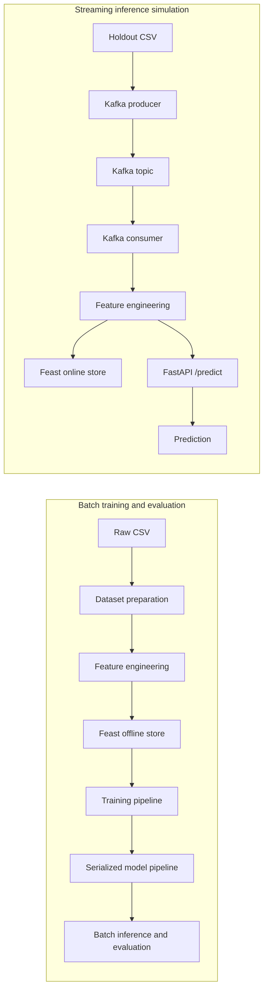
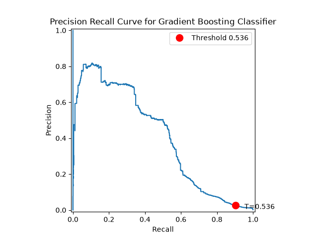
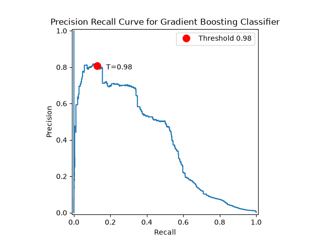

# Financial Crime Detection

<a target="_blank" href="https://cookiecutter-data-science.drivendata.org/">
    
</a>
<a href="https://github.com/calebhadley1/financial-crime/actions/workflows/tests.yml">
  
</a>
<a href="https://github.com/calebhadley1/financial-crime/actions/workflows/tests.yml">
  
</a>

This repository demonstrates an end-to-end machine learning prototype for transaction
laundering detection. Raw transaction data is prepared in batch, transformed into
reusable features, registered with Feast, used to train and serialize a model, and
served through FastAPI. A Kafka producer and consumer simulate real-time transaction
scoring.

The focus is on the engineering path from data preparation to inference: reproducible
feature transformations, point-in-time feature retrieval, imbalanced-class training,
containerized serving, and a streaming integration test. This is a local prototype,
not a production financial-crime detection service.

## Overview
- Batch data preparation and feature engineering with Python, pandas, and Parquet
- A Feast feature store with offline historical retrieval and an online SQLite store
- Train-only preprocessing and class-imbalance handling with scikit-learn
- Serialized feature-engineering and inference pipelines
- FastAPI model serving in Docker
- Kafka-based streaming simulation from transaction input to API prediction
- Academic exploratory analysis and modeling in the [papers](papers/README.md) directory
- Automated test suites (unit and integration)

## Architecture


The batch path creates the persisted feature-engineering transformer and model pipeline
needed by the streaming path. The consumer receives raw transaction records, applies
the persisted feature engineer, pushes the engineered record to Feast, and sends the
transacton ID and event timestamp to the API. Feast is currently used for historical training
retrieval and online feature writes.

## Roadmap

The project is intentionally being developed in stages. The next improvements are:

- [ ] Register models and evaluation results with MLflow.
- [ ] Explore graph-based detection with synthetic data: https://github.com/SantanderAI/gen-fraud-graph

## Setup
### Download Source Data
- Download the required input dataset from https://www.kaggle.com/datasets/ealtman2019/ibm-transactions-for-anti-money-laundering-aml
- I used Version 1 of the dataset. As of August 2026 there are no new versions published, but Kaggle retains all versions should the data get updated in the future. The dataset is licensed through [Community Data License Agreement – Sharing – Version 1.0](https://cdla.dev/sharing-1-0/)
- The dataset contains a three different data sizes (Small, Medium, Large) with two different frequencies of laundering density (Low, High) totaling 6 datasets. I used the HI-Small datasaets for the sake of this project which contain roughly 5 million transactions and 500K bank accounts with 0.1% laundering rate
- Copy the `HI-Small_accounts.csv`, `HI-Small_Patterns.txt` and `HI-Small_Trans.csv` to `data/raw`
### Python Environment
Install [uv](https://docs.astral.sh/uv/) and run:

```powershell
uv venv --python 3.12
.\.venv\Scripts\activate
uv sync
```

On macOS or Linux, activate with `source ./.venv/bin/activate`.
The Makefile provides equivalent convenience commands when GNU Make is available.

### Batch workflow
1. Download the dataset described above and copy the three source files into `data/raw`.
2. Prepare the training and holdout files:

  ```powershell
  typer financial_crime/dataset.py run
  ```

3. Engineer features and labels:

  ```powershell
  typer financial_crime/features.py run
  ```

4. Apply the Feast definitions from the feature repository:

  ```powershell
  cd financial_crime\feature_store\feature_repo
  uv run feast apply
  cd ..\..\..
  ```

5. Train and serialize the complete pipeline:

  ```powershell
  typer financial_crime/modeling/train.py run
  ```

6. Run batch inference and evaluation on the holdout data:

  ```powershell
  typer financial_crime/modeling/predict.py run
  ```

The default outputs are written to `data/processed` and `models/pipeline`.

### API
Build and start the API:

```powershell
docker compose up --build api
```

Open [localhost:8000/docs](http://localhost:8000/docs). The API currently accepts
a list of transaction IDs and their corresponding event timestamp. Every transaction must be already
available in Feast.

Prometheus metrics are exposed at [localhost:8000/metrics](http://localhost:8000/metrics).
When the full Compose stack is running, Prometheus is available at
[localhost:9090](http://localhost:9090) and scrapes the API every 15 seconds.

A request has this shape:

```json
[
    {
      "ID": "transaction-id", # UUID
      "event_timestamp": "2022-09-01T00:20:00" # datetime
    }
]
```

The response currently contains one integer prediction for each feature record. It does
not yet include calibrated probabilities, the applied threshold, or model metadata:

```json
[{"prediction": [0], "probability": 0.99}]
```

### Feature Store
The local Feast repository uses Parquet for historical features and SQLite for the
registry and online store. Run `feast apply` before training. The feature definitions
are in `financial_crime/feature_store/feature_repo/feature_definitions.py`. In the
current streaming simulation, Feast receives pushed features but the API receives the
engineered record directly from the consumer.

### Kafka
The Compose stack contains ZooKeeper, Kafka, the API, a producer, and a consumer. The
producer reads `data/processed/dataset_50k.csv` and publishes records to
`transaction-fraud-detection-topic`. The consumer engineers each record, pushes it to
Feast, and calls the API at `/predict`.

Start the complete simulation with:

```powershell
docker compose up --build
```

The producer intentionally sleeps between records to simulate a live stream, so the
50k-row holdout can take a long time to finish. Stop the stack with `Ctrl+C`.

## Automated Tests
Unit tests can be run with the following command:
```powershell
uv run pytest --cov=financial_crime
```

## Modeling Results

The following model results were determined through EDA spanning univariate, bivariate, and multivariate exploration, feature engineering, forward feature selection, and hyperparameter tuning of the max_depth, n_estimators, and decision threshold using PR-AUC and Optuna across various models. Ultimately, I found the Gradient Boosting classifier had the strongest performance on this dataset.

Feature Engineering was essential to find the relationships between accounts. We created the following features:
- Was the sending and receiving Account the same?
- Was the sending and receiving Bank the same?
- One-Hot encoding for all categorical features (Payment Format, Payment Currency, Receiving Currency)
- What is the Account's frequency of transactions by payment format across different windows (10sec, 30sec, 1min, ..., All Time)
- Has the Paying Account sent money to the Receiving Account before?
- How often does the Account use the type of Payment format? (For example if they only use credit card but suddenly use Bitcoin)

For hyperparamter tuning and model evaluation I utilized temporal data splitting to ensure no data leakage, since we engineer features that are time dependent (such as whether two accounts have interacted before). The reported results were evaluated on a holdout set containing 1,003,970 negative class and 1,699 positive class instances (0.001% fraud).

Initial baseline modeling showed that models learned to always predict the negative class due to extreme class imbalance. After implementing undersampling of the majority class to a 2:1 negative/positive ratio we see increased positive class performance, but it did not fully transfer into the holdout set where true class imbalance is found. Instead there is high recall and extremely low precision. This model may be good enough for a team with a large number of human resources to review fraud alerts. We catch the majority of fraud but have many false positive cases as well. See the below classification report and precision recall curve on a holdout set using the hyperparamter tuned model:

Gradient Boosting Classifier:
n_estimators: 65
max_depth: 4
decision_threshold: 0.536

```
              precision    recall  f1-score   support

           0       1.00      0.94      0.97   1003970
           1       0.03      0.90      0.05      1699

    accuracy                           0.94   1005669
   macro avg       0.51      0.92      0.51   1005669
weighted avg       1.00      0.94      0.97   1005669
```



To create other options for companies which do not have an ability to work through large false positive counts, I used decision boundary tuning. We can see in the below PrecisionRecallDisplay that moving the threshold from 0.536 to 0.98 can improve the precision at the expense of recall, giving companies less alerts to work through while still catching a large count of fraudulent transactions. For example a threshold of 0.98 yields Precision = 0.81, Recall = 0.13.




## Generated Artifacts

| Artifact | Purpose |
| --- | --- |
| `data/processed/dataset.csv` | Training source after dataset preparation |
| `data/processed/dataset_50k.csv` | Holdout data used by batch and streaming inference |
| `data/processed/features.parquet` | Engineered features for Feast and training |
| `data/processed/labels.parquet` | Labels and entity timestamps for training |
| `models/pipeline/feature_engineer.pkl` | Persisted feature-engineering transformer |
| `models/pipeline/` | Persisted preprocessing and model pipeline |
| `financial_crime/feature_store/feature_repo/data/` | Local Feast registry, online store, and logs |

## Project Organization

```
├── LICENSE            <- MIT license
├── Makefile           <- Convenience commands for environments, data, formatting, and linting
├── README.md          <- Project overview, setup, architecture, and roadmap
├── data
│   ├── external       <- Data from third party sources.
│   ├── interim        <- Intermediate data that has been transformed.
│   ├── processed      <- The final, canonical data sets for modeling.
│   └── raw            <- The original, immutable data dump.
│
├── docs               <- MkDocs project documentation
│
├── models             <- Trained and serialized models, model predictions, or model summaries
│
├── notebooks          <- Jupyter notebooks. Naming convention is a number (for ordering),
│                         the creator's initials, and a short `-` delimited description, e.g.
│                         `1.0-jqp-initial-data-exploration`.
│
├── papers             <- Archival academic work done on the subject completed in graduate school
|
├── references         <- Data dictionaries, manuals, and all other explanatory materials.
│
├── reports            <- Generated analysis as HTML, PDF, LaTeX, etc.
│   └── figures        <- Generated graphics and figures to be used in reporting
│
├── docker-compose.yml  <- Local Kafka, API, producer, and consumer stack
├── Dockerfile*         <- Container definitions for the API and streaming services
├── pyproject.toml      <- Python dependencies and Ruff configuration
│
└── financial_crime   <- Application and modeling source code
    │
    ├── __init__.py             <- Makes financial_crime a Python module
    │
    ├── config.py               <- Store useful variables and configuration
    │
    ├── dataset.py              <- Scripts to download or generate data
    │
    ├── features.py             <- Batch feature engineering and label preparation
    │
    ├── api                     <- FastAPI service for model inference
    ├── feature_store           <- Feast definitions and local stores
    ├── kafka                   <- Kafka producer/consumer streaming simulation
    ├── modeling
    │   ├── __init__.py
    │   ├── pipelines           <- Training and inference orchestration
    │   ├── transformers        <- Feature engineering and preprocessing
    │   ├── predict.py          <- Batch inference and evaluation
    │   └── train.py            <- Model training and serialization
    │
    └── plots.py                <- Code to create visualizations
```

--------

